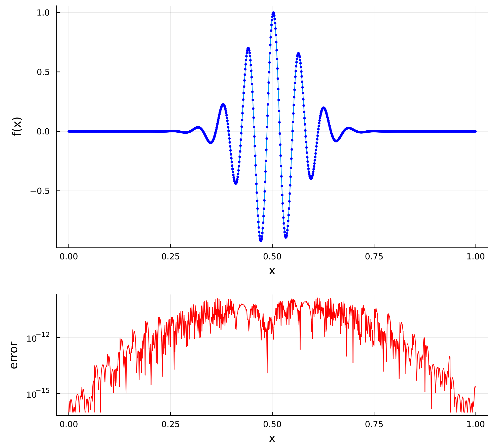
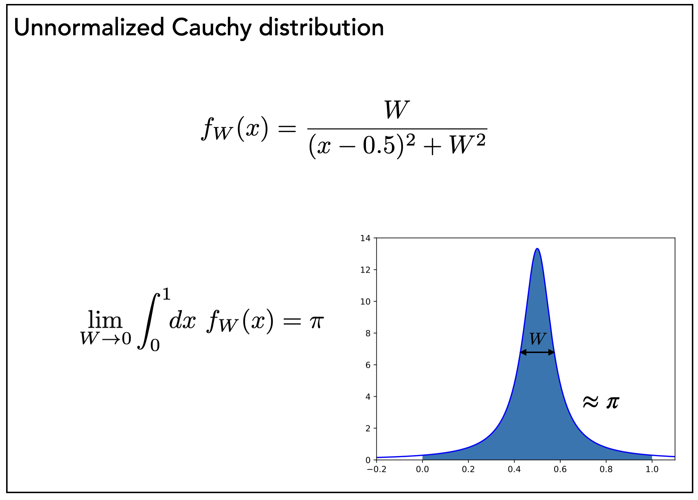
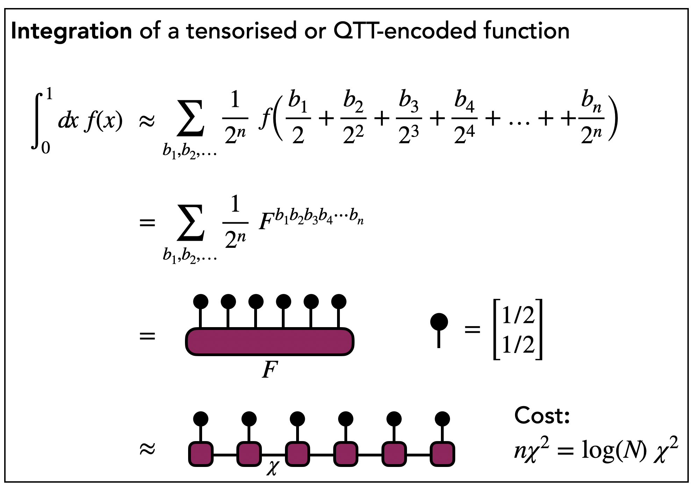
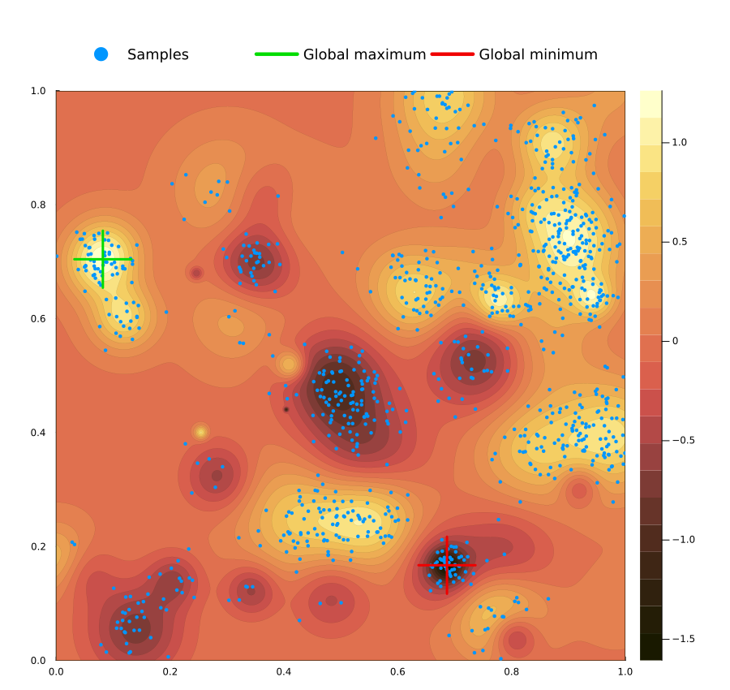
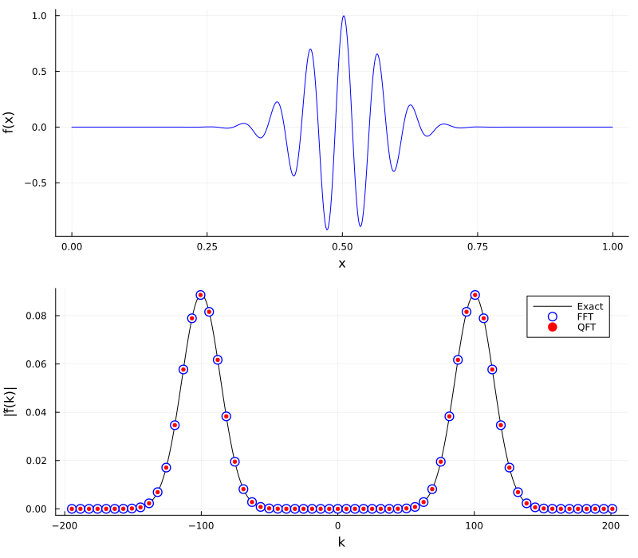

# Hands-On Tutorial 3

## Table of Contents

- [Tutorial 1: Load and Plot a QTT Function](#tutorial-1)
- [Tutorial 2: Integrate a QTT Function](#tutorial-2)
- [Tutorial 3: Load and Sample a 2D Function](#tutorial-3)
- [Tutorial 4: Quantum Fourier Transform of a QTT Function](#tutorial-4)

To get started with today's tutorials, first make sure you are in the correct directory (`Tutorials/HandsOn3`). 

Once you are, set up the local project by running:
```
julia --load setup.jl
```

You should see the ITensor Man graphic and a message indicating that the correct Hands On project is activated.

Optionally, you can check the local project is correctly set up by doing:
```
julia> ]
(HandsOn3) pkg> status
...
```
to check that the activated project is "HandsOn3" and that the required dependencies (the ones in Project.toml) are all loaded.

<a id="tutorial-1"></a>
<details>
  <summary><h2>Tutorial 1: Load and Plot a QTT Function</h2></summary>

In this tutorial, you will load and plot a one-dimensional
function encoded as an MPS in the quantics tensor train (QTT) format.

Include the file `includet("1-load-function.jl")` (using `includet` includes with tracking
of code changes and is recommended). 
Run the `main()` function and observe the output and plotting window.

A typical output might be:
```
julia> res = main();
Loading function: f(x) = exp(-(x-0.5)^2/0.01)*cos(100*x)
W = 1.000E-02
a = 1.000E+02
Performing tensor cross interpolation:
After sweep 1, max error = 1.3375404419083188e6
After sweep 2, max error = 0.0004152201100605102
After sweep 3, max error = 1.1156810197920919e-10
After sweep 4, max error = 8.735276391114155e-11
After sweep 5, max error = 8.735276391114155e-11

Interpolated function onto 2^32 = 4294967296 virtual grid points
Tensor cross performed 2538 calls to the function
Max rank χ=10

Error on extracted (plotted) points = 8.9106E-10
```
<p align="center">
  
</p>

1. Change the various inputs to the `main` function, such as the frequency `a` of the function
   or the parameters controlling the tensor cross function used to "load" or interpolate `f(x)`. 
   Can you get the error to be large or otherwise get the tensor cross to fail? What do you suspect
   might be the reason for the failure?

2. What's the most complicated function you can successfully load? Try something with multiple scales.

3. For an optional challenge, can you alter the `extract_function_values` function at the top
   of the file to plot over a custom x range `[x1,x2)` instead of the full `[0,1)`? What is the most
   elegant way to accomplish this using the QTT matrix product state representation of the function?


</details>

<a id="tutorial-2"></a>
<details>
  <summary><h2>Tutorial 2: Integrate a QTT Function</h2></summary>

In this tutorial, you will implement a Julia function that integrates a
one-dimensional function encoded as an MPS in the quantics tensor train (QTT)
format.

The function to be integrated is an unnormalized Cauchy distribution (or Lorentzian)
which has an integral of $\pi$ in the limit of its width $W$ approaching zero.

<p align="center">
  
</p>

The task of integration on $[0,1)$ can be adapted to the QTT tensor network setting 
by the following mathematical steps:

<p align="center">
  
</p>

**Your task** is to complete an implementation of code that performs the above integration
method by contracting single-index tensors with components $[1/2, 1/2]$ onto every open
index of an MPS.

1. Open the file `2-integrate.jl` and load this file using `include("2-integrate.jl");` in the Julia terminal.
Run the `main` function as `res = main();` and read the output. The initial implementation just returns the (incorrect) number 1.0 from the `integrate` function which results in a large error.

2. Read the function `integrate` at the top. The ITensor `I` is provided for you to contract with other
ITensors making up the integration diagram above, ultimately resulting in a scalar ITensor.
Add the missing line or lines of code inside the provided loop to create the vectors (black dots)
in the diagram above and contract them with each MPS tensor and accumulate (contract) the result into `I`.

   To make a single-index ITensor with index `s` and elements `[a,b]`, use `ITensor([a,b], s)`.

3. Once you have a working `integrate` function, rerun `res = main();` in the Julia terminal and see if you now get a reasonable approximation of $\pi$. Adjust the width $W$ to smaller values to see how much you can improve the approximation.

4. As optional "stretch goals", try changing the function to another one you believe is challenging to integrate (e.g. highly oscillatory or multi-scale functions). Does the loading and integration process continue to work or eventually break? 

   Another optional goal is to modify the `integrate` function to integrate over a different region besides $[0,1)$.

</details>

<a id="tutorial-3"></a>
<details>
  <summary><h2>Tutorial 3: Load and Sample a 2D Function</h2></summary>

In this tutorial, you will load a two-dimensional function $f(x,y)$ (a sum of random positive
and negative Gaussians) into an MPS using tensor cross interpolation. The first `nbits` sites
of the MPS encode the bits of $x$ and the remaining `nbits` sites encode the bits of $y$.

The code then draws samples from the MPS, which occur with probability proportional to $|f(x,y)|^2$, 
and plots them (blue points) on top of the function. The global maximum and minimum of the function,
found by a brute-force search, are marked by green and red crosses.

<p align="center">
  
</p>

1. Load the file using `include("3-2d-function.jl");` and run `res = main();`. Where do the samples concentrate?
Do any land close to the global maximum or minimum?

2. Try adjusting the number of samples, e.g. `main(; Nsamples=5000)`, the random function through `random_seed`, 
and the tensor cross interpolation parameters `maxdim` and `cutoff`.

3. As an optional "stretch goal", think about how sampling could be used to search for the optima of a function 
without a brute-force search:
    * How would the samples be distributed if the MPS represented a power of the function such as $f(x,y)^2$ instead?
    * Can you devise a recursive "divide-and-conquer" approach based on sampling of MPS to recursively zoom into regions which are likely to contain the global maximum or minimum?

</details>

<a id="tutorial-4"></a>
<details>
  <summary><h2>Tutorial 4: Quantum Fourier Transform of a QTT Function</h2></summary>

In this tutorial, you will Fourier transform a one-dimensional function encoded as an MPS 
in the QTT format by applying the quantum Fourier transform (QFT) to it as an MPO. 

Despite its name, the QFT is just the discrete Fourier transform

$$\frac{1}{\sqrt{N}} \sum_{x} f(x)\, e^{-2\pi i j x}\ , \quad j=0,1,\ldots,N-1$$

acting on all $N=2^n$ grid points $x$. Remarkably, it can be written as an MPO of small rank once the 
order of the output bits is reversed. The code in `resources/quantum_fourier_transform.jl` constructs this MPO 
directly using polynomial interpolation, following the paper:

- Jielun Chen and Michael Lindsey, "Direct interpolative construction of the discrete Fourier transform 
as a matrix product operator", [arXiv:2404.03182](https://arxiv.org/abs/2404.03182)

The function being transformed is the same oscillating Gaussian $f(x) = e^{-(x-1/2)^2/W} \cos(a x)$ from Tutorial 1,
whose Fourier transform is a pair of Gaussians centered at $k = \pm a$. Here we use the convention

$$\hat{f}(k) = \int f(x)\, e^{i k x}\, dx$$

for the Fourier transform, so that dividing the output of the QFT by $\sqrt{N}$ gives $\hat{f}(k)$ at the wavevectors $k=-2\pi j$. 
(These are spaced by $2\pi$ because $f(x)$ is defined on an interval of length 1.) The results of the QFT are compared
to the exact Fourier transform and to a conventional fast Fourier transform (FFT) computed with FFTW.

<p align="center">
  
</p>

1. Load the file using `include("4-quantum-fourier-transform.jl");` and run `res = main();`. Check that the 
QFT, FFT, and exact results agree, and compare the times taken by the QFT and the FFT.

2. Adjust the frequency `a` and width `W`, e.g. `main(; a=200, W=3E-3)`. How do the function and its Fourier transform change?
How do the ranks of the two MPS change? (You may need to increase `log_nfreqs` to see larger frequencies.)

   Always check the plot of $f(x)$ too: for very narrow functions, such as `W=1E-3`, tensor cross interpolation can miss
   part of the peak and load the wrong function even though it reports a small error. When this happens the QFT (which transforms
   the loaded MPS) no longer agrees with the FFT and exact results (which use the true function).

3. Increase the number of bits `n` in steps of two, such as `main(; n=18)`, `main(; n=20)`, .... The cost of the FFT scales as 
$N \log N$ with $N=2^n$, while the QFT scales only linearly in $n$. At what `n` does the QFT become faster?
(Be careful going beyond `n=26` or so, where the vector used by the FFT starts requiring gigabytes of memory.)

4. As an optional "stretch goal", read the function `extract_fourier_transform_values` to understand how the low positive and
negative frequencies are extracted from the MPS `Mk`. Then try transforming a different function, such as the
Cauchy distribution from Tutorial 2, whose Fourier transform decays exponentially in $|k|$.

   Note that the "Exact" curve in the plot comes from the function `exact(k)` defined near the end of `main`, which is 
   only correct for the original oscillating Gaussian. When you change `f(x)`, either update `exact(k)` to the Fourier 
   transform of your new function or remove that curve from the plot and compare the QFT to the FFT only.

</details>
