# Hands-On Tutorial 4

## Table of Contents

- [Tutorial 1: Tensor Networks](#tutorial-1)
- [Tutorial 2: Complete a Belief Propagation Implementation](#tutorial-2)
- [Tutorial 3: Belief Propagation on the 2D Ising Model](#tutorial-3)
- [Tutorial 4: BP Cluster Expansion](#tutorial-4)
- [Stretch Tutorial: Quantum Belief Propagation](#stretch-tutorial)

<a id="tutorial-1"></a>
<details>
  <summary><h2>Tutorial 1: Tensor Networks</h2></summary>
  <hr>

We are going to combine the `NamedGraphs.jl` and `ITensors.jl` packages to build tensor networks of varying topology.

To get started with today's tutorials, first make sure you are in the correct directory (`Tutorials/HandsOn4`). Once you are, activate the project for this hands-on session and instantiate the dependencies:
```julia
julia> pwd()
"[...]/ITensorSchool-2026/Tutorials/HandsOn4"

julia> readdir()
14-element Vector{String}:
 "1-tensornetworks.jl"
 "2-bp-implementation.jl"
 "3-beliefpropagation.jl"
 "4-clusterexpansion.jl"
 "5-quantumbp.jl"
[...]

julia> ]

(@v1.13) pkg> activate .
  Activating project at `[...]/ITensorSchool-2026/Tutorials/HandsOn4`

(HandsOn4) pkg> instantiate
    Updating registry at `~/.julia/registries/General.toml`
    Updating `[...]/ITensorSchool-2026/Tutorials/HandsOn4/Project.toml`
  [86223c79] + Graphs v1.15.0
  [9136182c] + ITensors v0.9.31
  [678767b0] + NamedGraphs v0.14.0
[...]
```

A simple graph `g` is just a series of vertices and edges between pairs of those vertices. There are no multiedges or self edges. The package `NamedGraphs.jl` is built around the `NamedGraph` object `g`, which can be constructed using either the pre-built graph constructors or our own via code like

```julia
julia> using Graphs: add_edge!

julia> using NamedGraphs: NamedGraph, NamedEdge

julia> g = NamedGraph([1,2,3]);

julia> es = [1 => 2, 2 => 3];

julia> for e in es
           add_edge!(g, e)
       end
```

First, let's run the script [1-tensornetworks.jl](./1-tensornetworks.jl)

```julia
julia> include("1-tensornetworks.jl")
main
```

By looking inside it you will see that it builds the 3-site path graph, which can be accessed and viewed via

```julia
julia> res = main();

julia> res.g
NamedGraph{Int64} with 3 vertices:
3-element Dictionaries.Indices{Int64}:
 1
 2
 3

and 2 edge(s):
2-element Vector{NamedEdge{Int64}}:
 1 => 2
 2 => 3
```

1. Modify the graph construction in `main()` to create a path graph on `L` vertices, where `L` is an integer variable that can be specified as a keyword argument to `main`. Compare the output to the pre-written constructor `named_path_graph(L::Int)` in `NamedGraphs.jl`. Add in a `periodic` flag to your constructor to add a periodic boundary if the flag is true.

With this you should be able to do
```julia
julia> res = main(; L = 5, periodic = true);

julia> res.g
NamedGraph{Int64} with 5 vertices:
5-element Dictionaries.Indices{Int64}:
 1
 2
 3
 4
 5

and 5 edge(s):
5-element Vector{NamedEdge{Int64}}:
 1 => 2
 1 => 5
 2 => 3
 3 => 4
 4 => 5
```

We can build a tensor network as a dictionary of tensors, one for each vertex of the `NamedGraph` `g`. The edges of the graph `g` (which are of the type `NamedEdge`) dictate which tensors share indices to be contracted over. Below is the periodic path on 5 vertices from exercise 1, and the tensor network that lives on it: one tensor $T_{v}$ per vertex, and one shared index per edge.

<p align="center">
  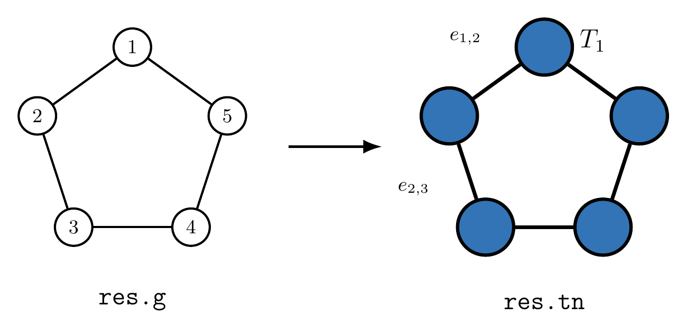
</p>

Provided in [ising_tensornetwork.jl](./ising_tensornetwork.jl) is a pre-built constructor for the tensor network representing the partition function of the ferromagnetic Ising model on a given `NamedGraph` `g` at a given inverse temperature `β`. The partition function reads

$$Z(\beta) = \sum_{s_{1} \in \lbrace -1, 1\rbrace}\sum_{s_{2} \in \lbrace -1, 1\rbrace} \cdots \sum_{s_{L}\in \lbrace -1, 1\rbrace}\prod_{\langle ij \rangle}\frac{\exp(\beta s_{i}s_{j})}{2},$$

where the product runs over the edges $\langle ij \rangle$ of the graph. For convenience, the Boltzmann weight on each edge has been scaled by a factor of $1/2$. This simplifies the analytic formulas below and removes an additive constant from the free energy density.

The tensor on each vertex is a copy tensor $\delta$, which forces the spin to take the same value on every edge leaving that vertex, with the symmetric square root of the Boltzmann matrix $W_{ss'} = \tfrac{1}{2} e^{\beta s s'}$ absorbed into each of its legs. Two neighbouring tensors then share exactly one full $W$ across their common edge, so contracting the whole network sums every spin configuration with the right weight.

<p align="center">
  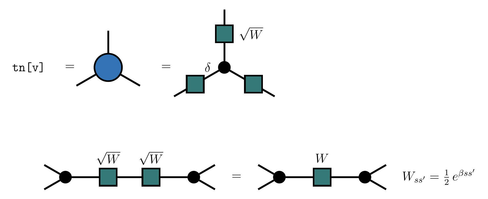
</p>

This object is returned by `main()`. You can inspect the individual tensors on each vertex of the constructed tensor network via `res.tn[v]` where `v` is the name of the vertex.
```julia
julia> res = main(; L = 3, periodic = false, beta = 0.2);

julia> show(res.tn[1])
ITensor ord=1
Dim 1: (dim=2|id=290|"e1_2")
NDTensors.Dense{Float64, Vector{Float64}}
 2-element
 1.0099835422515933
 1.0099835422515933
```

This tensor network can be contracted by multiplying all the tensors together. This contraction is pre-computed for you in `main()` using the function `contract_network` from [contract_network.jl](./contract_network.jl).

```julia
julia> res = main(; L = 3, periodic = false);

julia> res.z
2.081072371838455
```

In 1D the partition function of the Ising model is analytically computable for any system size L and both periodic and open boundaries. With the $1/2$ scaling on each edge the results are

$$Z_{OBC}(\beta) = 2\cosh^{L-1}(\beta)$$

for open boundaries and

$$Z_{PBC}(\beta) = \cosh^{L}(\beta) + \sinh^{L}(\beta)$$

for periodic boundaries.

2. Compare the output of `res.z` with these values for both periodic and open boundaries. Do they agree? If they do, then congratulations, you just solved the 1D PBC and OBC Ising model with a tensor network approach.

This is the end of the current tutorial, continue on to the next tutorial or click [here](#table-of-contents) to return to the table of contents.

</details>

<a id="tutorial-2"></a>
<details>
  <summary><h2>Tutorial 2: Complete a Belief Propagation Implementation</h2></summary>
  <hr>

In the previous tutorial, we contracted the tensor network exactly by multiplying the tensors together, vertex by vertex. This can only be done efficiently for tree-like networks (those with no loops, or only a few) and only if care is taken over the order of contraction.

In this tutorial we are going to contract tensor networks in an efficient, but approximate manner via belief propagation (BP). The BP code lives in the file [belief_propagation.jl](./belief_propagation.jl). It is not fully implemented, and you are asked to finish implementing it. Tutorials 3 and 4 both use this file, so they will only give correct answers once you have completed it.

**The algorithm.** BP associates a *message* to every directed edge $v \to w$ of the graph. A message $m_{v \to w}$ is a an `ITensor` living on the indices shared by the tensors $T_v$ and $T_w$. You can think of it as an approximation to the environment that vertex $w$ sees when it looks towards $v$, exactly like the `L` and `R` environment tensors you built in Hands-On 1 when computing an expectation value of an MPS. The messages are determined self-consistently by the update rule

$$m_{v \to w} \propto T_{v} \prod_{u \in \partial v,\, u \neq w} m_{u \to v},$$

i.e. the new message out of $v$ towards $w$ is the tensor $T_{v}$ contracted with all the messages coming *into* $v$ except the one coming from $w$.

<p align="center">
  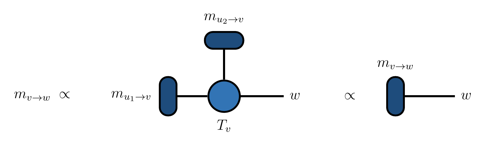
</p>

Starting from some initial guess, all the messages are updated repeatedly until they stop changing. Once converged, the contraction of $T_{v}$ with *all* of its incoming messages gives a scalar $Z_{v}$,

<p align="center">
  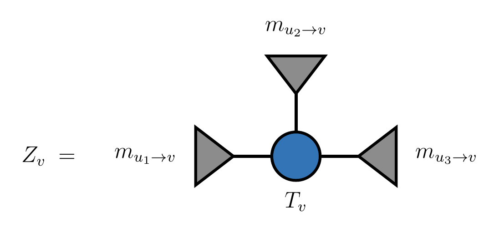
</p>

and the BP approximation to the free energy density is

$$\phi_{BP} = \frac{1}{N}\sum_{v} \ln Z_{v} \approx \frac{1}{N}\ln Z ,$$

after the messages have been suitably normalized (that part is done for you). On a tree the messages are exactly the environments and BP is exact. On a path graph, for example, the message $m_{2 \to 3}$ is everything to the left of that edge contracted together, playing the same role as the `L` environment you built in Hands-On 1. On a graph with loops BP is an approximation.

<p align="center">
  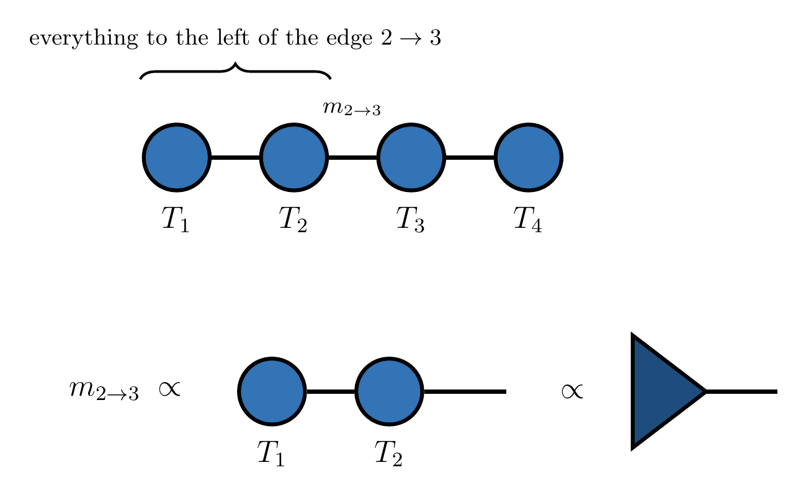
</p>

1. First, run the `main` function provided in [2-bp-implementation.jl](./2-bp-implementation.jl). It builds the Ising tensor network on a path graph of `L` sites, runs BP on it and compares the result to exact contraction. Since a path graph is a tree the two should agree, but they do not yet because the implementation is incomplete.

```julia
julia> include("2-bp-implementation.jl")
main

julia> res = main();
BP Algorithm Converged after 1 iterations
BP free energy density:    0.0
Exact free energy density: 0.1524751716982743
BP free energy density DOES NOT agree with exact contraction (it should on a tree)
```

2. Open [belief_propagation.jl](./belief_propagation.jl). The three numbered steps `(1)`, `(2)`, `(3)` mark the missing pieces. A few things you will need:
   - `tn[v]` is the `ITensor` on vertex `v` and `messages[e]` is the message on the directed edge `e`. `src(e)` and `dst(e)` give the two ends of `e` and `reverse(e)` the edge pointing the other way.
   - `boundary_edges(g, [v]; dir = :in)` returns the directed edges of `g` pointing into `v`. `all_edges(g)` returns every directed edge (both directions for each edge of `g`).
   - `contract_network(ts::Vector)` contracts a vector of `ITensor`s together and returns the resulting `ITensor`. `normalize` rescales an `ITensor` to have unit norm. A scalar `ITensor` `t` can be converted to a number with `t[]`.

3. Step `(1)` is the function `updated_message`, which should compute the new message along the directed edge `e`. The directed edges pointing into `src(e)`, excluding the one coming from `dst(e)`, are already collected for you in `incoming_es`. Build the vector of tensors `[tn[src(e)], messages[e_1], messages[e_2], ...]`, contract it and normalize. Once you have done this run `main()` again. BP will now take more than one iteration but the answer will still be wrong.

4. Step `(2)` is the function `message_distance`, which is used to decide whether BP has converged. For each directed edge `e` in `all_edges(g)`, compute `1 - dot(messages[e], old_messages[e])^2`, which vanishes when the new and old (normalized) messages are parallel, and return the mean over all directed edges.

5. Step `(3)` is the function `phi_factor`, which should contract the tensor `tn[v]` with *all* of the messages pointing into `v` and return the resulting scalar $Z_{v}$. Once complete, `main()` should report agreement:

```julia
julia> res = main();
BP Algorithm Converged after 6 iterations
BP free energy density:    0.15247517169827435
Exact free energy density: 0.1524751716982743
BP free energy density AGREES with exact contraction (as it should on a tree)
```

Note that this pass/fail check is only meaningful on a tree, where BP is exact. The script checks that the graph is a tree before judging the result, so if you swap in a graph with loops it will just print the two numbers side by side. That is the situation we move to in the next tutorial.

6. Try different values of `L` and `beta`. How does the number of iterations BP takes to converge on a path graph depend on `L`? Why?

You can inspect the converged messages via `res.messages`, which is a dictionary keyed by `NamedEdge`. For example, on the path graph the message from vertex 1 to vertex 2 is
```julia
julia> using NamedGraphs: NamedEdge

julia> res.messages[NamedEdge(1 => 2)]
```
Compare it to the tensor `res.tn[1]`. Why are they parallel?

This is the end of the current tutorial, continue on to the next tutorial or click [here](#table-of-contents) to return to the table of contents.

</details>

<a id="tutorial-3"></a>
<details>
  <summary><h2>Tutorial 3: Belief Propagation on the 2D Ising Model</h2></summary>
  <hr>

Now that you have a working BP implementation, let's use it on graphs with loops. The function `main` in [3-beliefpropagation.jl](./3-beliefpropagation.jl) builds an $L_{x} \times L_{y}$ square grid tensor network representing the partition function of the Ising model in 2D. Inverse temperature is set via the `beta` kwarg and periodic boundaries (in both directions) can be added with the kwarg `periodic`. Returned is the number of iterations BP took to converge (`niters`), and the rescaled free energy density (`phi_bp_tn`)

$$\phi(\beta) = -\beta f(\beta) = \frac{1}{L_{x}L_{y}}\ln(Z(\beta)).$$

We can do the following to get the BP computed value for $\phi$ on a 3x1 OBC square grid. This is just a path graph, like in the previous tutorial.
```julia
julia> include("3-beliefpropagation.jl")
main

julia> res = main(; Lx = 3, Ly = 1, beta = 0.2, periodic = false);
BP Algorithm Converged after 3 iterations

julia> res.phi_bp_tn
0.24429444141332002
```
1. Compare the result to the analytical value for 1D OBC

$$\phi_{OBC}(\beta) = \frac{1}{L_{x}}\ln\left(2\cosh^{L_{x}-1}(\beta)\right).$$

They should agree if you're BP implementation is correct, even though we used BP to compute it. Why?

2. We can also get the BP approximated free energy density for a periodic ring.
```julia
julia> res = main(; Lx =  3, Ly = 1, periodic = true);
BP Algorithm Converged after 8 iterations

julia> res.phi_bp_tn
0.019868071835749606
```
Compare the result to the 1D free energy density on PBC,

$$\phi_{PBC}(\beta) = \frac{1}{L_{x}}\ln\left(\cosh^{L_{x}}(\beta) + \sinh^{L_{x}}(\beta)\right).$$

They don't agree. Why? Pick a finite value of $\beta$ between $0$ and $1$ and compute both the exact PBC free energy density vs $L_{x}$ for $L_{x} = 3, 4, \ldots, 20$ and the BP free energy density using the `main` function (set $L_{y} = 1$, `periodic = true`). You can also pass `outputlevel = 0` as a kwarg to `main` to suppress the output from running BP.

Plot the absolute error between the BP approximated $\phi$ and the exact $\phi$ as a function of $L_{x}$ on a log scale. What's the scaling? Why? The `Plots.jl` package is loaded by the script, so you can do something like

```julia
julia> plot(Lxs, bp_abs_errs; yscale = :log10, xlabel = "System size Lx", ylabel = "abs error")
```
and you should see something like the following (here $\beta = 0.2$).

<p align="center">
  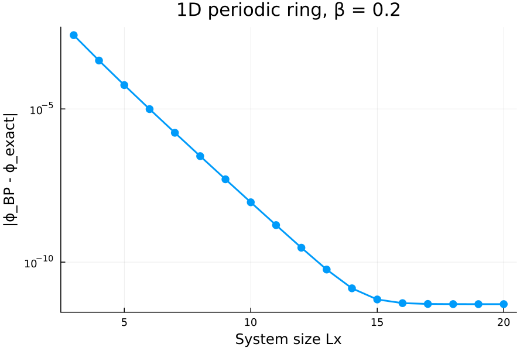
</p>

Inspect the values for `phi_bp_tn` returned by `main` versus system size. Do you notice something odd? Why are they all the same value?

Now we're going to move fully into 2D. Let's compute the BP approximate free energy density on a OBC square grid with $L_{x} = L$ and $L_{y} = L$ as a function of $\beta$.

```julia
julia> betas = [0.05 * (i - 1) for i in 1:21];

julia> results = [main(; Lx = 15, Ly = 15, periodic = false, beta, outputlevel = 0) for beta in betas];

julia> phi_bps = [res.phi_bp_tn for res in results];
```

Congratulations. You just approximately solved the 2D Ising model on a 15x15 square lattice for twenty one different inverse temperatures in a matter of seconds.

3. How does the number of iterations that BP took to converge (`res.niters`) depend on the inverse temperature? Plot this. Where's the peak? Is it near the known critical point $\beta_{c} = \ln(1 + \sqrt{2})/2 \approx 0.4407$ of the 2D model? Or somewhere different?

<p align="center">
  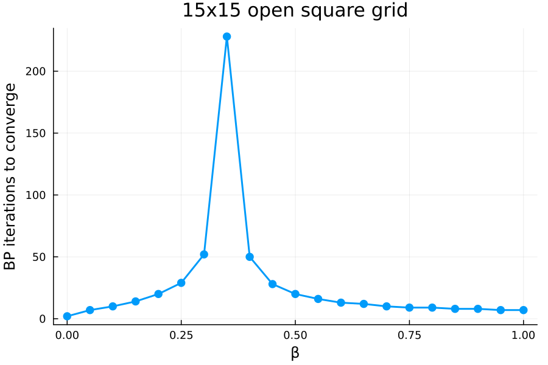
</p>

Included in [ising_tensornetwork.jl](./ising_tensornetwork.jl) is a function `ising_phi` for computing the exact rescaled free energy of the 2D model in the thermodynamic limit via Onsager's famous result. This is returned by `main` as `phi_exact`. With our $1/2$ rescaling of the Boltzmann weights it reads

$$\phi(\beta) = -\beta f(\beta) = -\ln 2 + \frac{1}{8\pi^{2}}\int_{0}^{2\pi}\int_{0}^{2\pi}\ln\left[\cosh^{2}\left(2\beta \right)-\sinh\left(2\beta \right)\cos\left(\theta_{1}\right)-\sinh\left(2\beta \right)\cos\left(\theta_{2}\right)\right]d\theta_{1} d\theta_{2}.$$

Let's compare our results to that.

4. Pick a small value for $\beta$ (say $\beta = 0.1$) and plot the absolute error between the BP result and the exact result as a function of graph size $L$ for $L_{x} = L$ and $L_{y} = L$ with open boundaries. How does it scale? Is this error coming from BP, or from somewhere else?

<p align="center">
  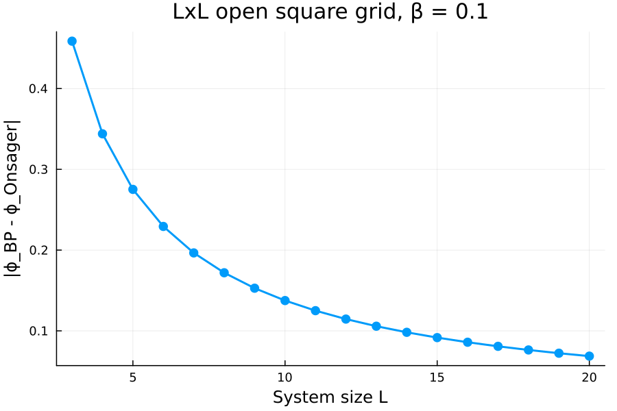
</p>

Now let's move to periodic boundary conditions.
```julia
julia> res = main(; Lx = 5, Ly = 5, periodic = true, beta = 0.2);
BP Algorithm Converged after 21 iterations

julia> res.phi_bp_tn, res.phi_exact
(-0.653411036960073, -0.6517635488435647)
```
5. What do you notice about the dependence of `phi_bp_tn` on $L$ with periodic boundaries?

As BP is letting us work directly in the thermodynamic limit with periodic boundaries, we can pick a small $L \geq 3$ and a fine range of betas and rapidly get the BP answer in the thermodynamic limit.

```julia
julia> betas = [0.01 * (i - 1) for i in 1:101];
```

6. Plot the absolute error between BP and Onsager's result as a function of $\beta$. Where does it peak? Compare to the location of the peak in the number of BP iterations from exercise 3.

<p align="center">
  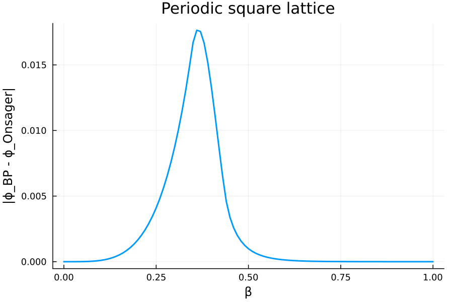
</p>

This is the end of the current tutorial, continue on to the next tutorial or click [here](#table-of-contents) to return to the table of contents.

</details>

<a id="tutorial-4"></a>
<details>
  <summary><h2>Tutorial 4: BP Cluster Expansion</h2></summary>
  <hr>

Now we are going to try to correct our BP results with a first order cluster expansion.

To first order, the correction to the partition function via a cluster expansion is a multiplicative rescaling

$$Z \approx Z_{BP} \prod_{l}Z_{l}$$

where $Z_{\rm BP}$ is the BP approximation of the partition function and the product is over the smallest loops $l$ in the lattice, with $Z_{l}$ defined as the contraction of the loop of tensors, closed off by the BP messages arriving from outside the loop.

<p align="center">
  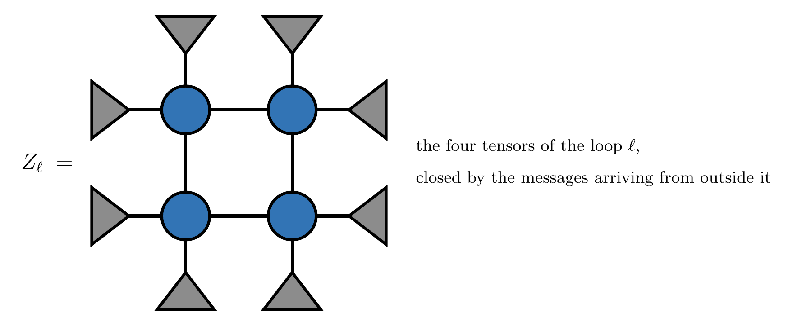
</p>

This formula is implemented in the function `phi_cluster_correction` in [belief_propagation.jl](./belief_propagation.jl) at the level of the rescaled free energy $\phi(\beta) = -\beta f(\beta)$, and is called by `main` in [4-clusterexpansion.jl](./4-clusterexpansion.jl). We use the `simplecycles_limited_length` function from `Graphs.jl` to enumerate the loops. Take a look at `phi_cluster_correction` and notice that it uses the `phi_factor` function you wrote in Tutorial 2.

For the periodic square lattice, setting $L \geq 5$ will give us a first order cluster expanded result for $\phi(\beta)$ directly in the thermodynamic limit. This is due to the homogeneity of the tensor network and that there is exactly one loop of size $4$ per vertex when $L \geq 5$. The parameters $L_{x} = 5, L_{y} = 5$ and `periodic = true` have all been set for you and `main` returns the BP value for `phi` (`phi_bp_tn`), the corrected value for `phi` (`phi_bp_corrected_tn`) and Onsager's exact result (`phi_exact`), all in the thermodynamic limit for your choice of $\beta$.

```julia
julia> include("4-clusterexpansion.jl")
main

julia> res = main(; beta = 0.2);
BP Algorithm Converged after 21 iterations

julia> res.phi_bp_tn, res.phi_bp_corrected_tn, res.phi_exact
(-0.653411036960073, -0.6518945381687995, -0.6517635488435647)
```

1. Calculate the BP error and the cluster corrected BP error, with respect to the exact solution, for a range of `betas`. Plot these.

```julia
julia> plot(betas, [bp_errs, bp_corrected_errs]; xlabel = "β", ylabel = "Absolute error", label = ["BP" "BP + loop correction"])
```

<p align="center">
  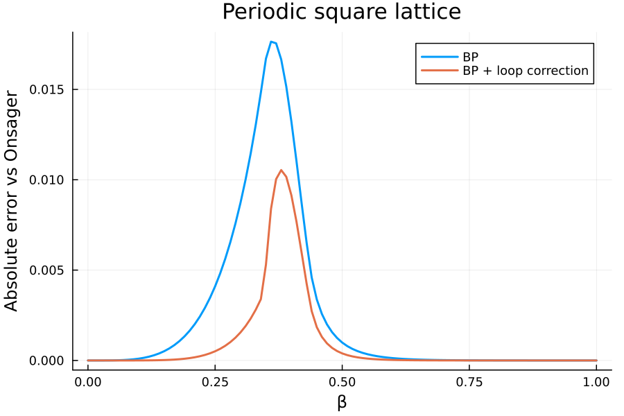
</p>

2. By how much does the correction reduce the error at its peak? Where does the correction help the most and where does it help the least? What do you think happens at higher orders in the expansion?

Using cluster expansions to improve tensor network contraction is an active research area. Two papers on it appeared in October 2025 and have since been published:

- J. Gray, G. Park, G. Evenbly, N. Pancotti, E. F. Kjønstad and G. K.-L. Chan, [Tensor network loop cluster expansions for quantum many-body problems](https://doi.org/10.1103/r6mz-6q3g), Phys. Rev. B **113**, 235135 (2026), [arXiv:2510.05647](https://arxiv.org/abs/2510.05647).
- S. Midha and Y. F. Zhang, [Beyond belief propagation: cluster-corrected tensor network contraction with exponential convergence](https://doi.org/10.1103/sdlx-d3tn), PRX Quantum **7**, 033010 (2026), [arXiv:2510.02290](https://arxiv.org/abs/2510.02290).

The expansion used here is Eq. (5) of the first paper, so you are now at the bleeding edge of research in this area.

This is the end of the current tutorial, continue on to the next tutorial or click [here](#table-of-contents) to return to the table of contents.

</details>

<a id="stretch-tutorial"></a>
<details>
  <summary><h2>Stretch Tutorial: Quantum Belief Propagation</h2></summary>
  <hr>

So far we have used belief propagation on classical partition functions. In this tutorial we use it on a quantum state. It is longer than the others, so it is here for anyone who finishes the first four.

Take a matrix product state $|\psi\rangle$, with a tensor $\psi_{v}$ on each site $v$ of a chain. Its norm $\langle \psi | \psi \rangle$ is a tensor network of the kind we have been contracting all along: a chain of tensors $T_{v}$, one per site. The tensor on site $v$ is the ket $\psi_{v}$ and the bra $\overline{\psi_{v}}$ joined over the physical index $s_{v}$, with the bond indices of the two kept separate.

<p align="center">
  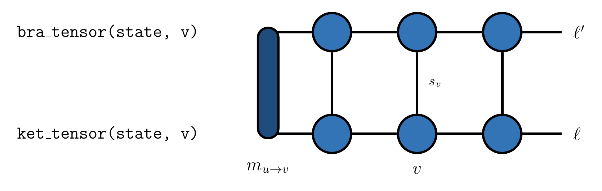
</p>

So we can run belief propagation on it exactly as in Tutorial 2. Each edge now carries two indices, the ket bond $\ell$ and the bra bond $\ell'$, so a message $m_{u \to v}$ is a matrix rather than a vector, and the update rule is the one from Tutorial 2 with $\psi_{v}\overline{\psi_{v}}$ in place of $T_{v}$,

$$m_{v \to w} \propto \psi_{v}\,\overline{\psi_{v}} \prod_{u \in \partial v,\, u \neq w} m_{u \to v}.$$

<p align="center">
  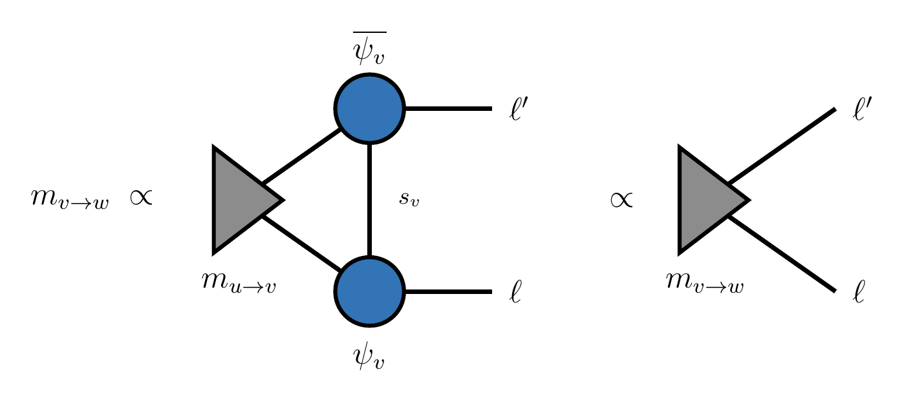
</p>

We keep the ket and the bra of each site as two separate tensors and evaluate the update in a fixed order. First multiply the incoming messages into the ket, one at a time. Then multiply by the bra:

<p align="center">
  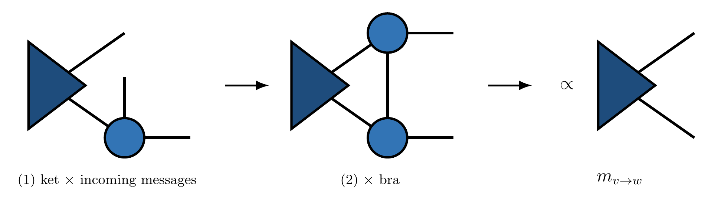
</p>

Expectation values work the same way. For an operator $O$ on site $v$,

$$\langle O_{v} \rangle = \frac{\langle \psi | O_{v} | \psi \rangle}{\langle \psi | \psi \rangle},$$

where the numerator is the norm network with $O$ applied to the ket on site $v$. Numerator and denominator are contracted with the same messages, so the normalization of the messages cancels and nothing like `binormalized_messages` is needed.

<p align="center">
  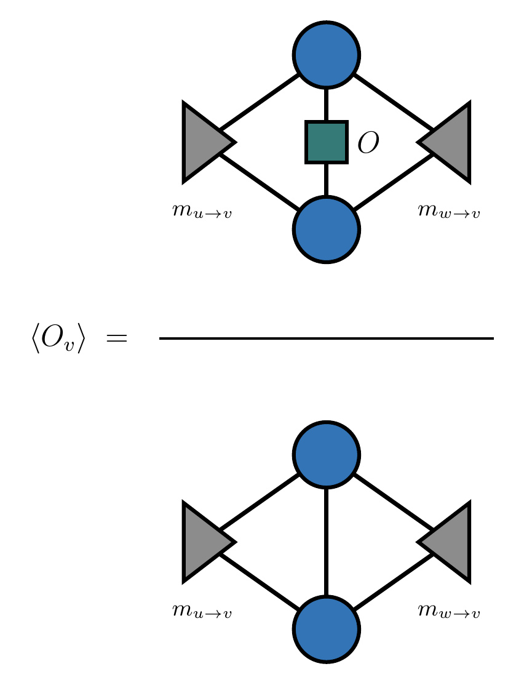
</p>

None of this is special to a chain. A tensor network state on any graph `g` has a norm network on the same graph, and everything above goes through unchanged.

**The AKLT state.** The state we will use is built for you in [aklt_tensornetwork.jl](./aklt_tensornetwork.jl), along with the spin operators. Every edge of the graph carries a singlet of two spin-1/2s, and at a vertex of degree $z$ those $z$ spin-1/2s are projected onto their maximal total spin $S = z/2$. On a ring every vertex has $z = 2$ and this is the spin-1 AKLT chain. On a square lattice $z = 4$ and it is the spin-2 AKLT state. The file gives you `ket_tensor(state, v)`, `ket_tensor(state, v, O)` with an operator applied, `bra_tensor(state, v)`, and `spin_operators(state.sites[v])`.

The AKLT state is the exact ground state of a simple Hamiltonian. Each bond carries a single shared singlet, so the two spins on any bond can never combine into their maximum total spin, and the state is annihilated by the projector onto that maximum. The parent Hamiltonian is the sum of those projectors over the bonds,

$$H = \sum_{\langle ij \rangle} P^{(ij)}_{2S}.$$

Each term is positive, so any state that every term annihilates is a ground state with energy exactly zero. For the spin-1 chain the projector onto total spin 2 can be written in terms of the Heisenberg coupling,

$$P_{2} = \frac{1}{3} + \frac{1}{2}\mathbf{S}_{i} \cdot \mathbf{S}_{j} + \frac{1}{6}\left(\mathbf{S}_{i} \cdot \mathbf{S}_{j}\right)^{2},$$

which is where the biquadratic term in the AKLT Hamiltonian comes from. Affleck, Kennedy, Lieb and Tasaki introduced the model in 1987 as an exactly solvable example of the Haldane gap.

**The code.** The functions to complete are in [quantum_belief_propagation.jl](./quantum_belief_propagation.jl) and the script that runs them is [5-quantumbp.jl](./5-quantumbp.jl), set up like the numbered scripts above. The message passing loop, the initial messages and an exact contraction routine to check against are written for you. The three numbered steps are yours. The functions have the same names as the ones in `belief_propagation.jl` but take the `state` as their first argument, so the two sets do not interfere.

1. Run `main`. It builds the AKLT state on an open path, which is a tree, so belief propagation should agree with exact contraction. It does not yet.

```julia
julia> include("5-quantumbp.jl")
main

julia> res = main();
BP Algorithm Converged after 1 iterations
Physical spin on vertex 2: S = 1.0
⟨(Sᶻ)²⟩ BP    = 0.0
⟨(Sᶻ)²⟩ exact = 0.6666666666666666
Quantum BP DOES NOT agree with exact contraction (it should on a tree)
```

2. Step `(1)` is `updated_message`. Follow the stages in the figure above: start from `ket_tensor(state, src(e))`, multiply in the message on each edge of `incoming_es` one at a time, then multiply by `bra_tensor(state, src(e))`, and normalize.

3. Step `(2)` is `expect`, the expectation value of an operator `O` on a vertex `v`. The numerator starts from `ket_tensor(state, v, O)`, takes in every message in `incoming`, and closes with `bra_tensor(state, v)`. The denominator is the same without `O`. Return the ratio.

4. Step `(3)` is `expect_bond`, the same for two neighbouring vertices `v` and `w`. Multiply each message in `incoming` into whichever of the two kets carries its index, contract the two kets over the bond they share, then close with both bras. Once this is done `main` should pass:

```julia
julia> res = main();
BP Algorithm Converged after 1 iterations
Physical spin on vertex 2: S = 1.0
⟨(Sᶻ)²⟩ BP    = 0.6666666666666666
⟨(Sᶻ)²⟩ exact = 0.6666666666666666
Quantum BP AGREES with exact contraction (as it should on a tree)
```

Now for some physics. Build the state on a periodic ring, `g = named_grid((L, 1); periodic = true)`, where every vertex has degree two and the state is the spin-1 AKLT chain.

5. Check that $\langle S^{z} \rangle = 0$ and $\langle (S^{z})^{2} \rangle = 2/3$. These are not much of a test of belief propagation: the single site reduced density matrix of the AKLT state is maximally mixed by symmetry, so any method that respects the symmetry gets them right.

6. Use `expect_bond` to build the Heisenberg bond energy $\langle \mathbf{S}_{v} \cdot \mathbf{S}_{w} \rangle = \langle S^{z}_{v} S^{z}_{w} \rangle + \tfrac{1}{2}(\langle S^{+}_{v} S^{-}_{w} \rangle + \langle S^{-}_{v} S^{+}_{w} \rangle)$ on one bond of the ring. In the thermodynamic limit the spin-1 AKLT chain has $\langle \mathbf{S}_{i} \cdot \mathbf{S}_{i+1} \rangle = -4/3$, which follows from its correlation function $\langle S^{z}_{i} S^{z}_{j} \rangle = \frac{4}{3}\left(-\frac{1}{3}\right)^{|i-j|}$. Compare your answer to this, and to exact contraction of the finite ring from `expect_exact(state, v, w, Ov, Ow)`, for a few values of `L`. Belief propagation gives $-4/3$ at every $L$, while exact contraction only approaches it as the ring grows. This is the same thing you saw for the periodic Ising chain in Tutorial 3.

7. Evaluate the parent Hamiltonian bond energy $\langle P_{2} \rangle$ and check that it is zero to machine precision. For $\langle (\mathbf{S}_{v} \cdot \mathbf{S}_{w})^{2} \rangle$, square the sum of three terms above to get nine, each still a product of one operator on $v$ and one on $w$, since $(A \otimes B)(A' \otimes B') = AA' \otimes BB'$. Unlike the correlations, this is a property of the state alone, so it holds at any ring size.

8. Move to a periodic square lattice, `named_grid((L, L); periodic = true)`, where the state becomes the spin-2 AKLT state and belief propagation is no longer exact. How far is the bond energy from exact contraction, and how does that compare to the Ising errors from Tutorial 3? The $P_{2}$ formula above is the spin-1 projector and does not apply here; on the square lattice the parent Hamiltonian projects onto total spin 4.

This is the end of the tutorials, click [here](#table-of-contents) to return to the table of contents.

</details>
